# Computational_Data_Science

This is EECS 598 Computational Data Science. Materials are copyright of Raj Rao. All rights for distribution and dissemination of notebooks are reserved. Please do not distribute or post on any public website without prior consent.

Only a small part about the Julia code in the total Jupyter Notebook was uploaded. 

https://cloud.bookalive.io/user/5b8c20bb31783c000627deac/tree/EECS%20598%20-%20Computational%20Data%20Science%20(F18)

learn2align.jl realize the algorithm of homographic transformation. We use it to combine two different pictures with same points together. We notice that each picture was taken from the same position but with the camera facing a different direction. To be able to compute the perpsective transformation we need to identify common set of points in each image. The points in one picture can be gotten from transformation, i.e. matrix calculation, of the points in another picture.

learn2classify.jl and learn2classifymany.jl employ neural network to make classifications. Handwriting recognition is one of the applications. To summarize: we discussed how to train a neural network with a single hidden layer using stochastic gradient descent. We saw how neural networks with non-linear activation functions can efficently separate classes that are not linearly separable.

learn2completematrix.jl realize an algorithm that learn to complete a matrix with missing entries. We now describe that algorithm that employs the SVD that takes advantage of the redundancy in a low rank matrix to fill in the missing entries, without assuming any pattern in the missing entries. 

We use this method to realize low rank image reconstruction. The other application is finding the missing value in the user score of movies. In this case the matrix is a movies-users matrix where users provide ratings and the missing entries corresponds to movies that have not been rated. Filling in the entries allows for Netflix to recommend movies you might like. See a description in the Netflix Prize and the SVD http://www.ams.org/publicoutreach/feature-column/fcarc-svd.

In learn2embedding.jl, we first embed a Matrix of Coordinates in a Distance Matrix. From the coordinates matrix X , we can construct a distance matrix  D such that Dij=Dji=d(xi,xj). We can also recover the coordinares matrix from the distance matrix. However, given a Euclidean distance matrix, we cannot uniquely determine the original coordinates. If X is a set of coordinates that gives us a particular D, then we will obtain the same  D from  (X.+μ)Q(X.+μ)Q  for any  μ  and any d×d  orthogonal matrix Q. That the Euclidean distance matrix is the same if we rotate the points is a conseqeuence of the orthogonal/unitary invariance of the Euclidean norm. If we used a non-unitarily invariant norm, we could rotate the points and the distance matrix would change, as we will briefly illustrate using the  ℓ1ℓ1  norm.

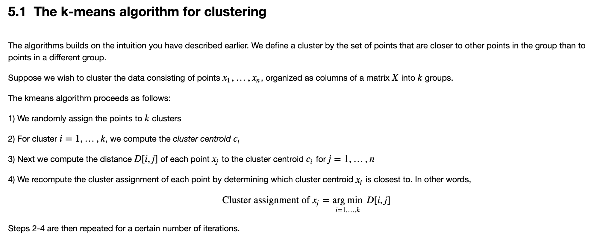

In learn2find_insync.jl, we are interested in finding k synchronized waveforms in a noisy m×n data matrix. We begin with a representative example of such a waveform x(t; a, b)=exp(−at)⋅sin(bt). We are interested in the problem of finding synchronized waveforms in an  m×n data matrix. In this setup we think of  m  as being the number of sensors and  n as being the number of samples or measurements; thus  X[i,:] represents the vector of time series measurements or samples recorded at sensor  i.

In the learn2detectgraphcommunities.jl, we are interested in discovering community structure in networks.
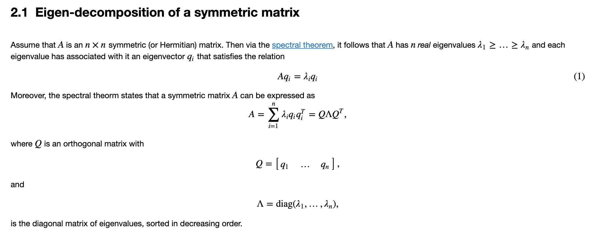
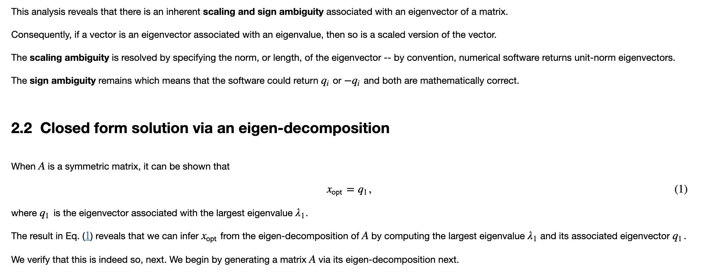
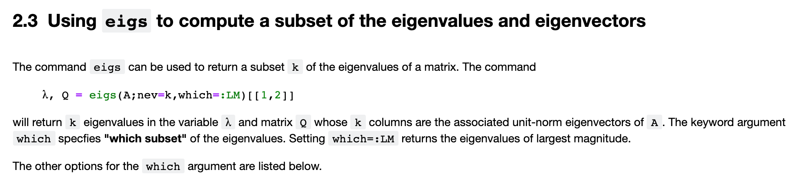
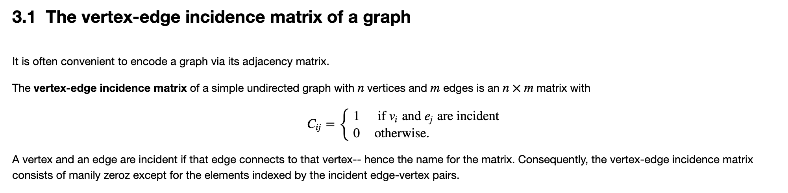
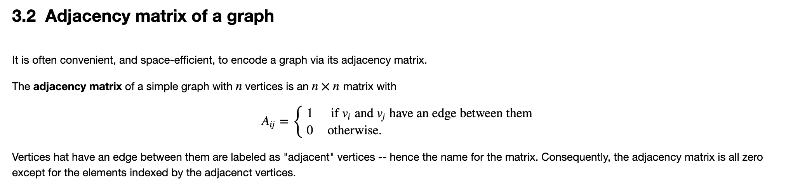
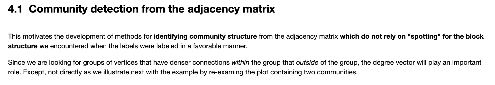
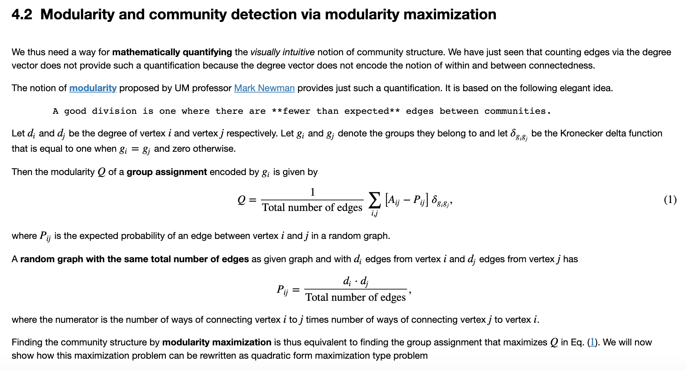

In the learn2project.jl, we are trying to to unmix images and audio signals using Independent Component Analysis (ICA)

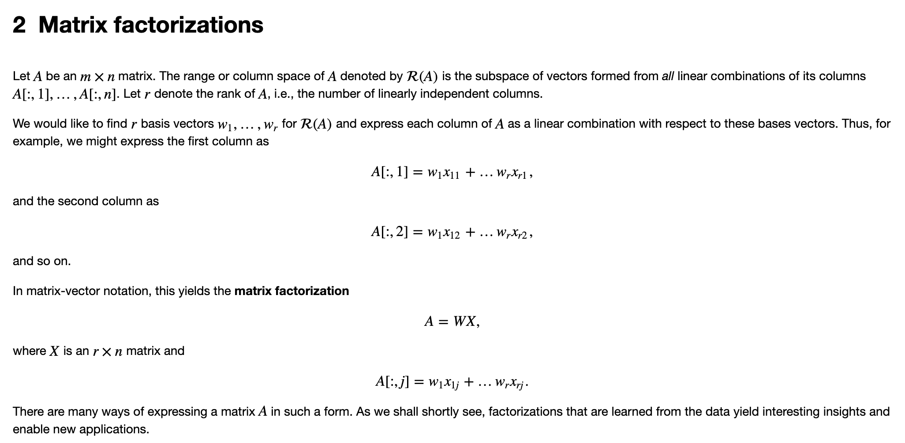
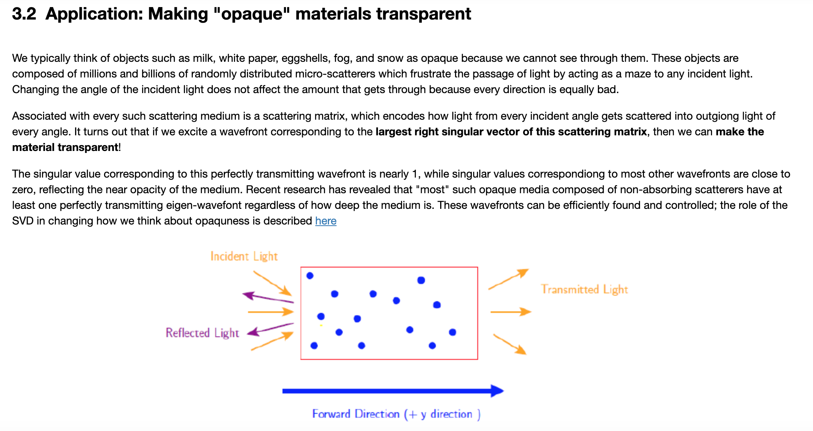
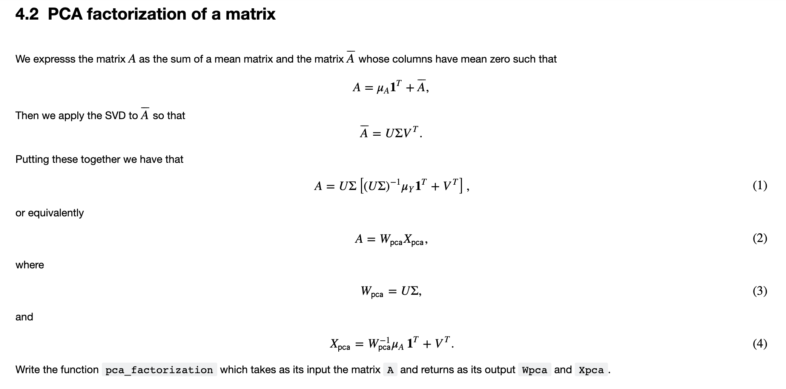
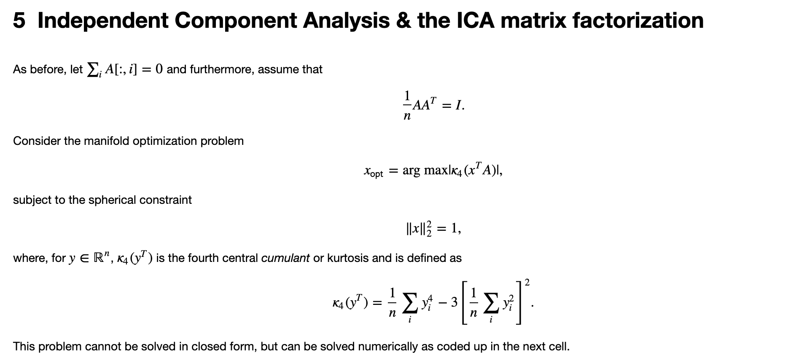

In neural_201, we conduct experiements on neural network in classification. We changed the activaion function, number of layers, number of neurons in each layer, and learning step to see whether there is an improvement in the classification accuracy.

In svd_video.jl, we use Singular Vector Decomposition (SVD) to decompose the video matrix in each frame. By doing that, we can seperate the walking people and flashing lights in the video and extract the background. Since in the videl matrix, the walking poeple and randomly flashing lights can be looked as random noise, by doing SVD, we keep the main or stable information, the background, in the remianed matrix. And the random noise was dropped in the rest, the last elements.

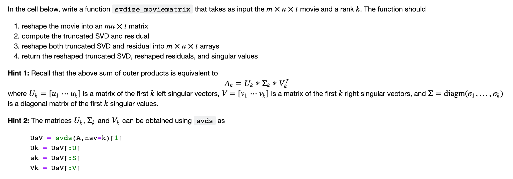
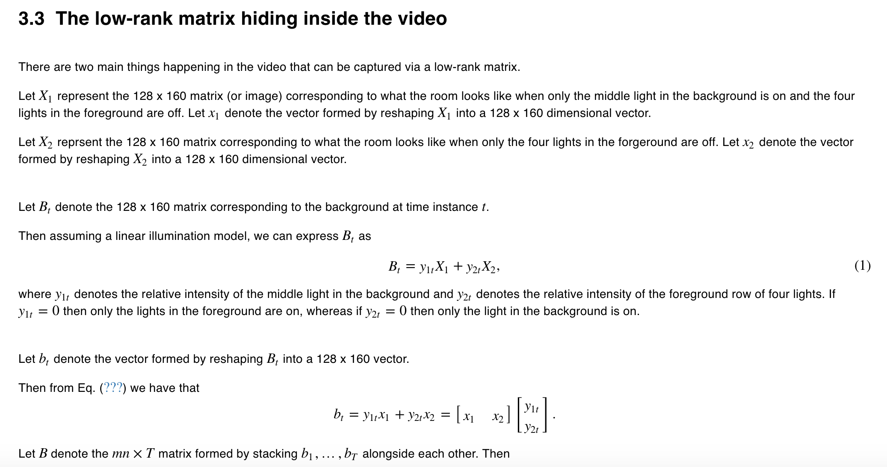
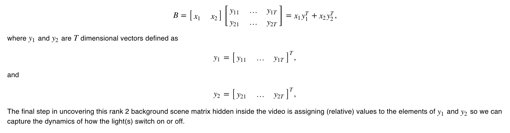
