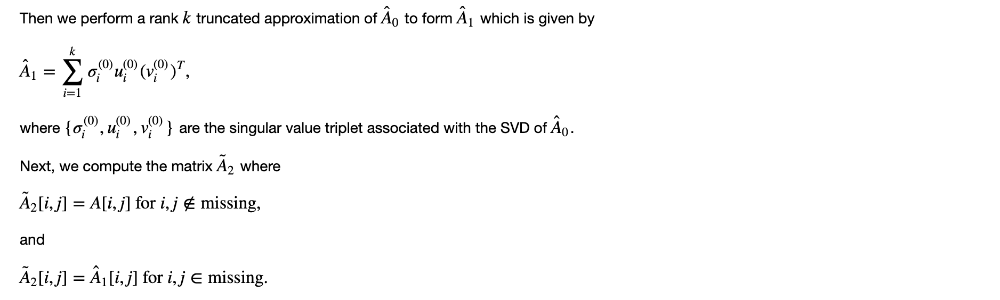

# Computational_Data_Science

This is EECS 598 Computational Data Science. Materials are copyright of Raj Rao. All rights for distribution and dissemination of notebooks are reserved. Please do not distribute or post on any public website without prior consent.

Only a small part about the Julia code in the total Jupyter Notebook was uploaded. 

https://cloud.bookalive.io/user/5b8c20bb31783c000627deac/tree/EECS%20598%20-%20Computational%20Data%20Science%20(F18)

learn2align.jl realize the algorithm of homographic transformation. We use it to combine two different pictures with same points together. We notice that each picture was taken from the same position but with the camera facing a different direction. To be able to compute the perpsective transformation we need to identify common set of points in each image. The points in one picture can be gotten from transformation, i.e. matrix calculation, of the points in another picture.

learn2classify.jl and learn2classifymany.jl employ neural network to make classifications. Handwriting recognition is one of the applications. To summarize: we discussed how to train a neural network with a single hidden layer using stochastic gradient descent. We saw how neural networks with non-linear activation functions can efficently separate classes that are not linearly separable.

learn2completematrix.jl realize an algorithm that learn to complete a matrix with missing entries. We now describe that algorithm that employs the SVD that takes advantage of the redundancy in a low rank matrix to fill in the missing entries, without assuming any pattern in the missing entries. 

We use this method to realize low rank image reconstruction. The other application is finding the missing value in the user score of movies. In this case the matrix is a movies-users matrix where users provide ratings and the missing entries corresponds to movies that have not been rated. Filling in the entries allows for Netflix to recommend movies you might like. See a description in the Netflix Prize and the SVD http://www.ams.org/publicoutreach/feature-column/fcarc-svd.
